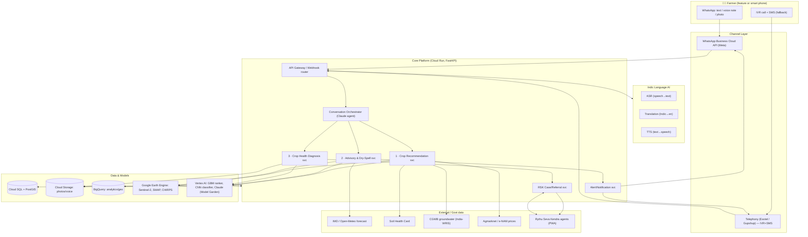

# Kisan Alert — Service Design & Architecture Plan

> **Status:** Design-for-review (no implementation yet). This document presents the full service flow, architecture, NFRs, API, data model, and AI models — with alternatives at every major decision point — so the team can approve or adjust before we build.

---

## 1. Context

**Problem.** Small and marginal farmers pick crops and manage water by habit/hearsay rather than data — soil health, groundwater depth, and rainfall are ignored, causing crop failure and financial loss.

**What we're building.** *Kisan Alert* — a voice-and-messaging agricultural intelligence platform in Indic languages with three components:

1. **Crop Recommendation Engine** — satellite + soil + groundwater data → what to grow.
2. **Real-time Advisory & Dry-Spell Alerts** — weather forecast + (simulated/satellite) soil-moisture → when to irrigate/fertilize.
3. **Crop Health Diagnosis** — photo/voice → AI diagnosis → routed to **Rythu Seva Kendras (RSK)** for expert follow-up.

**Locked decisions (from clarification):**
- Farmer channel: **WhatsApp primary**; IVR + SMS documented as the low-literacy / no-internet fallback.
- Sensors: **simulated + satellite** now; clean seam left for real **LoRaWAN IoT** later.
- Cloud: **GCP primary** (Earth Engine), **AWS documented alternative**.
- Deliverable now: this design doc for review; implementation follows approval.

**Design goals mapped to the evaluation rubric:**

| Criterion | Weight | How this design targets it |
|---|---|---|
| Problem–Solution Fit | 20% | Every component maps 1:1 to a stated pain point; scope kept to the 3 asks. |
| AI/Technical Execution | 25% | Real ML doing real work: GBM crop ranker, CNN+VLM disease diagnosis, FAO-56 irrigation model, dry-spell forecasting, Indic ASR/TTS. End-to-end thin slice across all 3. |
| Deployability & Scalability | 25% | Managed cloud (Cloud Run + Pub/Sub), uses existing govt data (SHC, IMD, CGWB, RSK); one district in weeks, scales via stateless services + queue. |
| Inclusivity & Accessibility | 15% | Indic voice/text (Bhashini/AI4Bharat), WhatsApp voice notes for low-literacy, IVR/SMS fallback, offline-tolerant design. |
| Impact Potential | 10% | State-wide reach through RSK network; each farmer touch is actionable. |
| Presentation & Clarity | 5% | Simple farmer journey + one-screen architecture an MP's office can grasp in 5 min. |

---

## 2. High-Level Architecture

**One-line pitch for the MP's office:** *A farmer sends a WhatsApp voice note in Telugu; within seconds an AI tells them what to plant, when to water, and — from a photo — what disease their crop has and which local officer to see.*

---

## 3. Farmer Service Flow (end-to-end thin slice)

**Onboarding (once):** farmer messages the WhatsApp number → picks language → shares/pins location (or village name) → we resolve the plot to a geo-cell and pull soil (SHC), groundwater (CGWB), and satellite baselines. Consent captured (DPDP).

**Component 1 — "What should I grow?"**
1. Farmer: *"నేను ఏ పంట వేయాలి?"* (voice/text).
2. ASR → intent = crop_recommendation.
3. Recommendation svc pulls features for the plot: soil N-P-K/pH (SHC), groundwater depth (CGWB), NDVI history (Sentinel-2 via Earth Engine), season, seasonal rainfall outlook (IMD), market price trend (Agmarknet).
4. GBM ranker + agronomic rules → top-3 crops with expected water need, risk, and margin.
5. Claude turns the ranked output into a short, plain-language explanation ("Prefer millets this Kharif — your groundwater is deep and rainfall outlook is below normal") → TTS → WhatsApp voice + text reply.

**Component 2 — "When do I water/fertilize + dry-spell alerts"**
1. Scheduled job (Cloud Scheduler) runs daily per active plot.
2. Advisory svc computes crop water requirement via **FAO-56 Penman-Monteith** (ET₀ × crop-coefficient Kc for the growth stage) minus effective rainfall and current soil moisture (SMAP/simulated sensor) → irrigation recommendation.
3. **Dry-spell detector**: if forecast shows N+ consecutive rainless days below a soil-moisture threshold → proactive push alert ("No rain expected 7 days — irrigate on day 3, mulch to save water").
4. Fertilization windows from crop calendar + soil test. Alerts sent via WhatsApp (fallback SMS).

**Component 3 — "My crop looks sick"**
1. Farmer sends a **photo** (and/or voice note describing symptoms).
2. Diagnosis svc: fine-tuned **CNN classifier** returns disease class + confidence; **Claude vision** validates, assesses severity, and produces treatment guidance grounded (RAG) on ICAR/state advisories; voice symptoms fused via Claude.
3. Farmer gets diagnosis + first-aid steps in their language (voice+text).
4. If low confidence, high severity, or farmer requests → a **case is opened and routed to the nearest RSK**; the agent sees it in a PWA, adds expert notes, and the resolution flows back to the farmer via WhatsApp. Loop closed.

---

## 4. Component Deep-Dives, Models & Alternatives

### 4.1 Channel Layer — WhatsApp primary
- **Recommended:** WhatsApp Business Cloud API (Meta) — free tier for user-initiated, supports voice notes, images, location, interactive buttons/lists; huge rural penetration.
- **Fallback (inclusivity):** IVR + SMS via **Exotel/Gupshup** — reaches feature phones with zero internet; template SMS for alerts. Same orchestrator behind both.
- **Alternatives:** Twilio (global, pricier in India), Karix/Kaleyra, or a lightweight **PWA** for smartphone farmers and RSK agents (offline-capable).

### 4.2 Indic Language AI (ASR / Translation / TTS)
- **Recommended:** **Bhashini** (Govt of India national language stack) + **AI4Bharat** models — IndicConformer (ASR), IndicTrans2 (translation), IndicF5/Indic-Parler (TTS). Strong "Digital Public Infrastructure" story for a govt audience; 22 scheduled languages.
- **Alternatives:** **Sarvam AI** (Saarika ASR, Bulbul TTS — excellent Indic quality, simple API); **Google Cloud** Speech-to-Text / Text-to-Speech / Translation (broad Indian-language coverage, tight GCP integration); **Claude** for translation/normalization of transcribed text. Recommend abstracting behind a `LanguageService` interface so any provider is swappable.

### 4.3 Component 1 — Crop Recommendation Engine
- **Recommended model:** **Gradient-Boosted Trees (XGBoost / LightGBM)** ranking crops on tabular features (soil NPK/pH, groundwater depth, NDVI trend, agro-climatic zone, season, rainfall outlook, price trend) + a thin **agronomic rules layer** (ICAR crop suitability, FAO **EcoCrop** ranges) as guardrails. Explanation narrated by **Claude Sonnet 5**.
- **Why:** tabular + small data → trees beat deep nets; interpretable feature importances build farmer/agronomist trust.
- **Alternatives:** rules-only EcoCrop/ICAR suitability (fastest MVP, no training data); a learned recommender (collaborative filtering on regional yields); Random Forest. **For the demo**, start rules + GBM hybrid.
- **Key inputs:** Sentinel-2 NDVI (Earth Engine), Soil Health Card, CGWB groundwater, IMD seasonal outlook, Agmarknet prices.

### 4.4 Component 2 — Advisory & Dry-Spell Alerts
- **Recommended model:** deterministic **FAO-56 Penman-Monteith** water-balance (ET₀ × Kc − effective rainfall − soil moisture) for irrigation depth/timing — a real, defensible agronomic model, not a black box. **Dry-spell detection** = forecast rainless-run + soil-moisture threshold, with an ML anomaly layer (Prophet/LightGBM) on rainfall time-series for early warning.
- **Sensor data:** **SMAP satellite soil moisture** + **simulated sensor** stream now; `SensorReading` schema + Pub/Sub topic left ready so real **LoRaWAN** devices publish to the same seam later (see §9).
- **Alternatives:** pure ML soil-moisture/ET forecast (needs more data); IMD Agromet advisories as a baseline/backstop; Open-Meteo (free) vs IMD vs ECMWF for forecasts.

### 4.5 Component 3 — Crop Health Diagnosis
- **Recommended model (two-stage):**
  1. **Fine-tuned CNN** — EfficientNetV2 or ViT trained on **PlantVillage + PlantDoc + local crop images**; fast, high-confidence disease class + severity; **TFLite export** enables on-device/offline path.
  2. **Claude vision (Opus 4.8 / Sonnet 5)** — validates the class, reasons over ambiguous/low-confidence cases, fuses the farmer's **voice-described symptoms**, and generates treatment steps **grounded (RAG)** on ICAR/state agri advisories to avoid hallucinated agro-chemistry.
- **Why two-stage:** specialist model = accuracy + offline; VLM = explanation, severity, multimodal fusion, and graceful handling of unknown pests.
- **Alternatives:** Vertex AI AutoML Vision (no-code training); Plantix/PlantNet APIs (fast but less controllable); VLM-only (simplest, weaker on rare local diseases). 
- **RSK routing:** confidence/severity thresholds → open `Case`, assign nearest RSK by geo, notify agent PWA, sync resolution back to farmer.

### 4.6 Conversation Orchestrator
- **Recommended:** a **Claude agent (Sonnet 5 default, Opus 4.8 for hard reasoning)** that does intent routing, slot-filling, tool-calling into the three services, and response generation — one coherent multilingual voice across all channels.
- **Alternatives:** Rasa/Dialogflow CX (deterministic NLU, cheaper at scale) as a front-line intent router with Claude behind it for generation. Recommend Claude-first for the hackathon, add a classifier router at scale for cost.

---

## 5. Cloud Architecture (GCP primary)

| Concern | Recommended (GCP) | AWS alternative |
|---|---|---|
| Compute (services) | **Cloud Run** (stateless, autoscale-to-zero), FastAPI/Python | ECS Fargate / Lambda |
| Events & async | **Pub/Sub** (alerts, sensor ingest, RSK notifications) | SNS/SQS or EventBridge |
| Scheduled jobs | **Cloud Scheduler** (daily advisory sweep) | EventBridge Scheduler |
| Transactional DB | **Cloud SQL PostgreSQL + PostGIS** (geospatial) | RDS PostgreSQL + PostGIS |
| Analytics/geo at scale | **BigQuery (+ BigQuery GIS)** | Redshift / Athena |
| Satellite/EO | **Google Earth Engine** (Sentinel-2, SMAP, CHIRPS pre-ingested) | Sentinel Hub / Open Data on AWS + SageMaker |
| Object store | **Cloud Storage** (photos, voice) | S3 |
| Cache | **Memorystore (Redis)** | ElastiCache |
| ML hosting | **Vertex AI** (GBM, CNN endpoints) | SageMaker |
| Claude models | **Vertex AI Model Garden** | **Amazon Bedrock** |
| Agent PWA | **Firebase Hosting + Auth** | Amplify |
| Secrets/IAM | Secret Manager, Cloud IAM | Secrets Manager, IAM |

**Why GCP primary:** Earth Engine removes most of the satellite-ingestion engineering for Components 1 & 2 (the biggest technical risk), and Claude is first-class via Model Garden. **AWS is a clean fallback** if the team prefers Bedrock or has MeitY-empanelment constraints — the design is portable (containers + Postgres + object store + queue are all standard).

---

## 6. Data Model (core entities)

- **Farmer** (id, phone, preferred_language, consent, created_at)
- **Plot** (id, farmer_id, geom [PostGIS point/polygon], area, agro_climatic_zone, soil_ref, groundwater_ref)
- **SoilProfile** (plot_id, N, P, K, pH, organic_carbon, source=SHC, sampled_at)
- **SensorReading** (plot_id, type=soil_moisture|temp|…, value, source=sim|satellite|lorawan, ts) ← *seam for real IoT*
- **WeatherForecast** (geocell, day, rain_mm, tmin, tmax, et0, source)
- **CropRecommendation** (plot_id, season, ranked_crops[jsonb], features[jsonb], model_version, created_at)
- **Advisory** (plot_id, type=irrigation|fertilizer|dryspell_alert, payload, severity, delivered_channel, ts)
- **DiagnosisRequest** (id, farmer_id, plot_id, media_ref, transcript, cnn_label, cnn_conf, vlm_result[jsonb], severity)
- **Case** (id, diagnosis_id, rsk_id, status, agent_notes, resolution, opened_at, closed_at)
- **RSK** (id, name, geom, staff, coverage_area)
- **Conversation/Message** (channel, direction, lang, intent, media_ref, ts)

---

## 7. API Design (representative REST, all versioned `/v1`)

**Channel ingress**
- `POST /v1/webhooks/whatsapp` — Meta webhook (messages, media, status). Verifies signature, enqueues to Pub/Sub.
- `POST /v1/webhooks/telephony` — IVR/SMS provider callback.

**Farmer & plot**
- `POST /v1/farmers` · `GET /v1/farmers/{id}`
- `POST /v1/plots` (geocode + attach soil/groundwater baselines) · `GET /v1/plots/{id}`

**Component 1**
- `POST /v1/recommendations` `{plot_id, season}` → ranked crops + explanation + audio_url.

**Component 2**
- `GET /v1/advisories/{plot_id}?type=irrigation|fertilizer|dryspell`
- `POST /v1/sensors/readings` (ingest; used by simulator now, LoRaWAN gateway later)
- Internal: daily sweep job → emits `advisory.created` / `dryspell.alert` events.

**Component 3**
- `POST /v1/diagnosis` (multipart: image + optional audio + plot_id) → diagnosis + treatment + audio_url + `case_id?`.
- `GET /v1/diagnosis/{id}`

**RSK case management (agent PWA)**
- `GET /v1/cases?rsk_id=&status=` · `GET /v1/cases/{id}`
- `PATCH /v1/cases/{id}` (assign / add notes / resolve → notifies farmer)

**Language utility (internal)**
- `POST /v1/lang/asr` · `POST /v1/lang/tts` · `POST /v1/lang/translate`

Auth: farmer via channel identity (verified phone); RSK agents via Firebase Auth + role. All write endpoints idempotent where feasible; media served via signed URLs.

---

## 8. Non-Functional Requirements (NFRs)

| Category | Target |
|---|---|
| **Latency** | Text/voice reply ≤ 3s p95 (recommendation/advisory); photo diagnosis ≤ 8s p95. Dry-spell alerts delivered within 15 min of forecast update. |
| **Availability** | 99.5% for farmer-facing paths; alert pipeline at-least-once via Pub/Sub with retries + DLQ. |
| **Scalability** | Stateless Cloud Run autoscaling; target 100k plots / 1M messages/day without redesign; batch advisory sweep partitioned by geo-cell. |
| **Low-connectivity** | WhatsApp works on 2G; SMS/IVR fallback for no-data; responses compact; optional TFLite on-device disease model for offline. |
| **Inclusivity** | ≥ 5 Indic languages at launch (Telugu-first for RSK/AP), full voice in+out, no literacy required; button/list menus for low-text UX. |
| **Cost** | Autoscale-to-zero services; cache soil/satellite features; route high-volume simple turns to Sonnet 5, escalate to Opus 4.8 only when needed; batch satellite pulls. |
| **Data residency & privacy** | India region (asia-south1/2); **DPDP Act 2023** consent, data minimization, farmer opt-out; PII encrypted at rest + in transit. |
| **Observability** | Cloud Logging/Monitoring, per-component tracing, model-version + confidence logged for every AI output; feedback capture for retraining. |
| **Accuracy/Safety** | Diagnosis treatment grounded (RAG) on ICAR/state advisories; low-confidence → human RSK; recommendations show "why"; agro-chemical dosages never free-generated. |
| **Maintainability** | Provider-abstraction interfaces (Language, LLM, EO, Channel) so any vendor is swappable; IaC (Terraform); CI/CD. |

---

## 9. IoT / Sensor Extensibility (future-proofing)

Now: `SensorReading` fed by a **simulator** + **SMAP satellite** soil moisture. The ingestion contract is fixed at `POST /v1/sensors/readings` → **Pub/Sub `sensor.reading`** topic. Later, real **LoRaWAN** soil sensors → a gateway (e.g., ChirpStack / The Things Network) → HTTP bridge publishes to the **same** endpoint/topic. **No core change** — only a new producer. Advisory svc already consumes from the topic, so real sensors light up automatically.

---

## 10. Deployability & Scale Story (for the 25% criterion)

- **Weeks-to-pilot:** reuses existing govt data (Soil Health Card, IMD, CGWB, Agmarknet) and the **existing RSK network** as the human layer — no new field infrastructure required. WhatsApp needs only a business number.
- **One district → state:** stateless services + queue + partitioned batch jobs scale horizontally; onboarding a new district = load its soil/groundwater/RSK reference data. Terraform makes standing up a new region repeatable.
- **Human-in-the-loop scaling:** AI handles the long tail of simple questions; only low-confidence/high-severity cases reach RSK officers, multiplying their reach.

---

## 11. Alternatives Summary (decision table)

| Layer | Recommended | Main alternatives |
|---|---|---|
| Channel | WhatsApp Cloud API + IVR/SMS fallback | Twilio; PWA app |
| Language AI | Bhashini + AI4Bharat | Sarvam AI; Google Cloud Speech/Translate |
| Orchestrator | Claude agent (Sonnet 5 / Opus 4.8) | Rasa/Dialogflow router + Claude |
| Crop rec | GBM + agronomic rules | EcoCrop rules-only; learned recommender |
| Irrigation | FAO-56 Penman-Monteith | ML soil-moisture forecast; IMD Agromet baseline |
| Dry-spell | Forecast run + soil-moisture threshold + ML | IMD advisory backstop |
| Disease | Fine-tuned CNN + Claude vision (RAG) | AutoML Vision; Plantix/PlantNet; VLM-only |
| Satellite | Google Earth Engine | Sentinel Hub / AWS Open Data |
| Cloud | GCP (Cloud Run, Vertex, BigQuery) | AWS (Fargate, Bedrock, SageMaker) |

---

## 12. Phased Roadmap

- **Phase 0 — Foundations:** repo, IaC, WhatsApp sandbox, DB schema, Language service (ASR/TTS/translate) wired.
- **Phase 1 — Component 3 (highest demo wallop):** photo diagnosis (CNN + Claude vision) → RSK case in PWA. End-to-end on WhatsApp.
- **Phase 2 — Component 1:** crop recommendation (rules → GBM) with Earth Engine + SHC/CGWB features.
- **Phase 3 — Component 2:** FAO-56 irrigation + dry-spell alert scheduler + simulated/SMAP soil moisture.
- **Phase 4 — Polish:** multilingual coverage, IVR/SMS fallback, dashboards, DPDP consent, demo script for the MP's office.

---

## 13. Verification (how we'll prove it works end-to-end)

- **Scripted WhatsApp demo** in Telugu covering all 3 flows: recommendation, dry-spell alert, photo diagnosis → RSK case → resolution back to farmer.
- **Component tests:** CNN accuracy on a held-out local disease set; FAO-56 output sanity-checked vs a worked agronomic example; GBM recommendation vs ICAR suitability for known plots; dry-spell alert fires on a synthetic rainless forecast.
- **Load check:** replay N concurrent messages; confirm p95 latency + Pub/Sub at-least-once delivery with DLQ.
- **Inclusivity check:** full voice-in/voice-out with no text; SMS fallback path delivers an alert.
- **Human-loop check:** low-confidence diagnosis correctly opens and routes a `Case` to the nearest RSK and syncs resolution back.

---

## 14. Open Questions for the Team (optional, non-blocking)

1. Target state/languages for the pilot — Telugu-first (AP, matches RSK) assumed; confirm others.
2. Do we have access to real **Soil Health Card / CGWB** datasets, or use ISRIC SoilGrids as a stand-in for the demo?
3. RSK integration: real API/handoff available, or model the PWA as a standalone agent console for now?
4. GCP vs AWS final call (design is portable either way).

---

### Next step
On approval, I'll scaffold the repo per **Phase 0** and build the **Component 3** thin slice first (best demo impact), on branch `claude/kisan-alert-architecture-7qyvkt`. I can also render this as a polished visual architecture doc (Artifact) for the MP's-office presentation.
