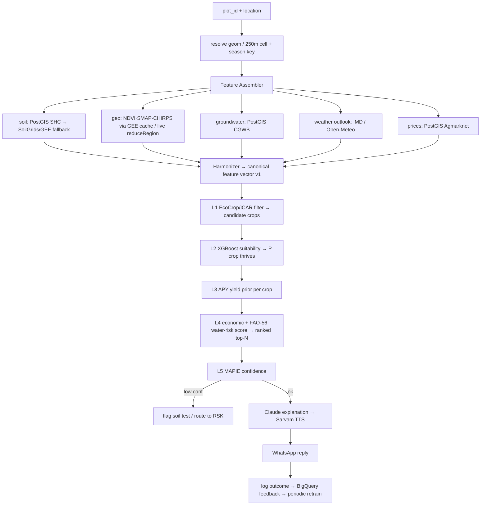

# Component 1 — Data & Model Flow (service design)

How the specific datasets and models from `component1-crop-recommendation.md`
fit together into one pipeline our service can actually run — chosen for
**requirements fit** and **compatibility between the services**.

> The hard part isn't picking datasets — it's that they disagree on spatial
> resolution, access method, cadence, and units. This doc pins how we reconcile
> them, then the end-to-end flow.

---

## 1. Design drivers (from the requirements)

| Requirement | Consequence for the flow |
|---|---|
| Real AI, works end-to-end | ML suitability + yield + uncertainty, not just rules |
| Runs in a district in weeks, scales | One geospatial integration (GEE) + cached features, stateless serving |
| Low-connectivity / voice-first | **Offline per-village precompute**; online path only refines |
| Trust / low-literacy | EcoCrop guardrail + confidence + plain-language *why* |
| Small/marginal farmer value | Rank by **profit + water-risk**, groundwater-aware |

---

## 2. Compatibility matrix (the crux)

Every source is reconciled to one canonical unit: **the plot** (a polygon, or a
250 m cell if the boundary is unknown) for a **season key** (e.g. `Kharif-2026`).

| Source | Native resolution | Cadence | Access | Native unit | How we reconcile |
|---|---|---|---|---|---|
| Sentinel-2 NDVI | 10 m | 5-day | **GEE** | reflectance idx | `reduceRegion(mean)` over plot polygon |
| SMAP soil moisture | 9 km | 1–3 day | **GEE** | m³/m³ | coarse → cell value for plot |
| CHIRPS rainfall | ~5.5 km | daily | **GEE** | mm | aggregate to season window |
| SoilGrids | 250 m | static | **GEE** (community) | **pH×10, N in cg/kg (total)** | `/10` for pH; **do NOT feed total-N as available-N** (see §4) |
| Soil Health Card | village / GPS point | ~3-yr | bulk CSV / portal | kg/ha + Low/Med/High | ETL → PostGIS, join by village/district |
| CGWB / India-WRIS | point wells | seasonal | portal / CSV | m below ground | ETL → PostGIS, spatial-interpolate to plot |
| Agmarknet prices | market (mandi) | daily | data.gov.in API | ₹/quintal | ETL → PostGIS, trailing trend per crop×market |
| District APY | district | yearly | data.gov.in / ICRISAT | t/ha | training store (yield priors), join by district×crop×season |
| EcoCrop ranges | — (per crop) | static | download | min/opt/max | static JSON knowledge base in repo |
| Kaggle dataset | — (rows) | static | download | its own N/P/K scale | **cold-start bootstrap only** (own units) |

**Two compatibility wins that shape the architecture:**
1. **GEE is the unifier.** Sentinel-2, SMAP, CHIRPS and SoilGrids all live in
   Earth Engine → one auth, one query interface, server-side spatial reduction.
   That collapses four resolution/format problems into a single
   `reduceRegion` call per plot. Everything else is tabular ETL.
2. **The plot × season key** is the join key that makes point-soil, coarse-
   weather, fine-NDVI and district-yield all line up.

---

## 3. Two-class ingestion architecture

```
GEOSPATIAL (Google Earth Engine)          TABULAR ETL (govt portals)
  Sentinel-2 NDVI ┐                          SHC bulk ─────┐
  SMAP moisture   ├─ reduceRegion(plot) →     CGWB wells ──┼─→ PostGIS
  CHIRPS rainfall │   geo-feature cache        Agmarknet ──┘   (soil, groundwater, prices)
  SoilGrids       ┘   (PostGIS/BigQuery)       APY ─────────→ BigQuery (yield training)
                                               EcoCrop ─────→ repo/knowledge/ecocrop.json
```

- **GEE side:** batch job precomputes per-village NDVI/moisture/rainfall nightly
  → cache. Online path may also call GEE live for a drawn plot polygon.
- **Tabular side:** scheduled ETL loads SHC / CGWB / Agmarknet into PostGIS and
  APY into BigQuery (for training). EcoCrop is a static file.

This split is deliberate: the two classes have *incompatible* access patterns
(raster compute vs. row queries), so we don't force them through one path — we
join them later at the feature vector.

---

## 4. Feature harmonization — the critical glue

Before any model sees the data, a harmonizer produces **one versioned, canonical
feature vector** per plot×season. This is where compatibility is enforced:

- **Units:** SoilGrids `phh2o` → `/10`; SMAP → volumetric %; CHIRPS summed over
  the season; prices → ₹/quintal trend.
- **⚠ Semantic mismatch (must not ignore):** SoilGrids **total nitrogen** (cg/kg)
  ≠ SHC **available nitrogen** (kg/ha) ≠ Kaggle's `N`. They are different
  quantities. **Do not** pipe SoilGrids N into a Kaggle-trained model.
  Resolution: train the *production* model on **SHC-native units**; use SoilGrids
  only as a categorical/relative gap-fill; keep Kaggle strictly for the
  cold-start prototype with its own schema. The feature schema is explicit and
  versioned so a model always gets the units it was trained on.
- **Resolution:** fine (NDVI) kept as-is; coarse (SMAP/CHIRPS) taken as the
  cell value; point (SHC/CGWB) spatially joined/interpolated.
- **Temporal:** everything aligned to the sowing-time decision — soil = latest
  SHC; NDVI = previous same-season windows (productivity proxy); rainfall =
  seasonal outlook (IMD/Open-Meteo) + CHIRPS climatology; moisture = current
  SMAP; price = trailing 3–12 mo trend + MSP.
- **Missingness:** SHC absent → SoilGrids; plot boundary absent → 250 m cell;
  price absent → district median. Every fallback is logged.

---

## 5. End-to-end flow



### Stage → dataset → model mapping

| Stage | Consumes | Produces | Backed by |
|---|---|---|---|
| L1 filter | EcoCrop ranges + harmonized vector | feasible crops + reason | knowledge base (no training) |
| L2 suitability | soil + weather features | P(crop thrives) | **XGBoost** (SHC-trained; Kaggle bootstrap) |
| L3 yield prior | district soil+weather+irrigation | expected t/ha per crop | **LightGBM** on **APY/ICRISAT** |
| L4 ranking | L2×L3 + Agmarknet price − cost, groundwater vs Kc | water-risk-adjusted margin, top-N | deterministic (FAO-56) |
| L5 uncertainty | L2 model | confidence / prediction set | **MAPIE** conformal |
| Explain | ranked JSON | Telugu voice+text | **Claude** + **Sarvam** |

L1 is also the **offline fallback**: if models/GEE are unavailable, the rule
filter alone still returns a safe, explainable answer.

---

## 6. Serving modes (compatibility with low-connectivity)

- **Offline / instant:** nightly batch runs the whole pipeline per village×season
  → a `village → top crops` table cached in PostGIS. An SMS/WhatsApp query is a
  fast lookup, works with no live model call.
- **Online / precise:** when the farmer shares a specific plot (polygon/GPS), the
  live path calls GEE `reduceRegion` + the models for a plot-specific answer.

Same code, two entry points; the offline table is just the online pipeline
pre-run. This keeps "runs in a district in weeks" and "voice/low-connectivity"
both true.

---

## 7. Feedback loop (what makes accuracy real)

Every recommendation + the farmer's actual choice and later yield/price outcome
is logged to BigQuery. Periodic retraining of L2/L3 on this real, local data is
what moves us off the semi-synthetic Kaggle bootstrap toward field accuracy —
and it compounds as the RSK network grows.

---

## 8. Build order (compatibility-safe)

1. **EcoCrop JSON + harmonizer schema** — define the canonical vector first; it
   is the contract every service plugs into.
2. **XGBoost on Kaggle** (its own units) → wire as L2 behind the L1 rule filter.
3. **Tabular ETL**: SHC + CGWB + Agmarknet → PostGIS; retrain L2 on SHC units.
4. **GEE integration**: NDVI/SMAP/CHIRPS/SoilGrids `reduceRegion` + village cache.
5. **APY yield models (L3) + economic/water-risk ranking (L4)**.
6. **MAPIE uncertainty (L5) + BigQuery feedback loop**.

Each step is independently shippable and never breaks the
`POST /v1/recommendations` contract — the harmonized vector and response shape
stay fixed; only the layer behind them gets smarter.
